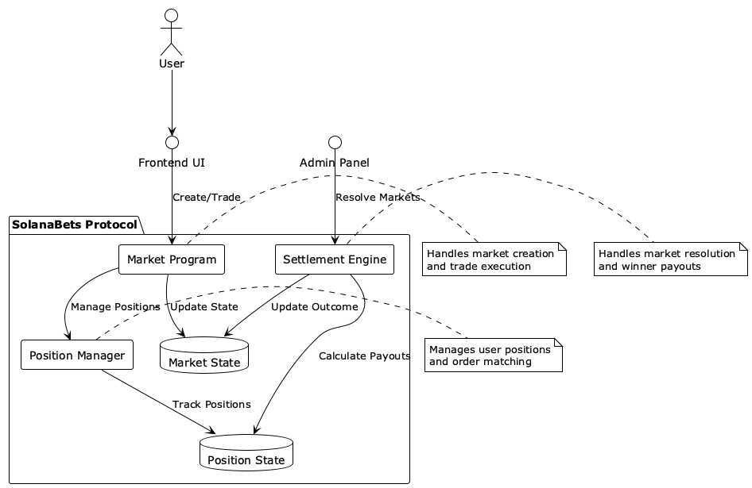
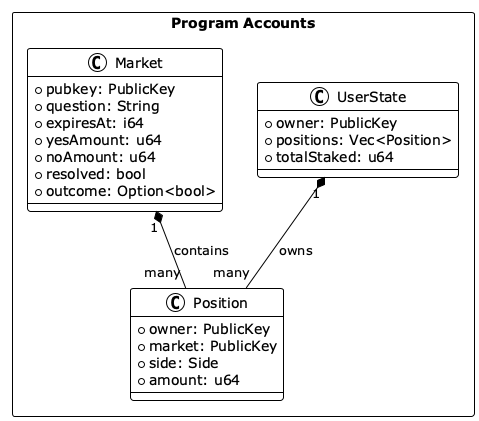
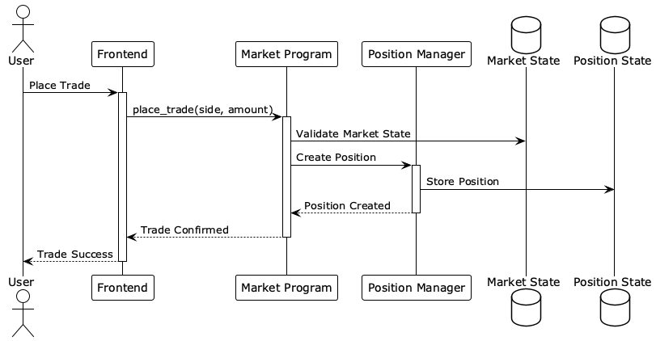
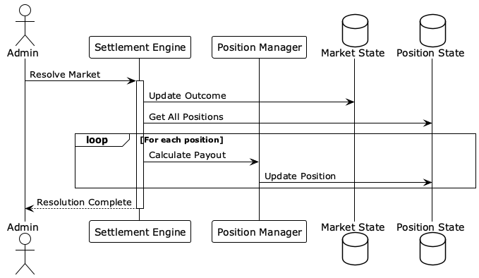

# SolanaBets Architecture Documentation

## 1. Core Components Overview



## 2. Account Structure



## 3. Trade Flow Sequence



## 4. Market Resolution Flow



## Implementation Details

### Market Program Instructions

```rust
pub fn create_market(
    ctx: Context<CreateMarket>,
    question: String,
    expires_at: i64,
) -> Result<()>

pub fn place_trade(
    ctx: Context<PlaceTrade>,
    side: Side,
    amount: u64,
) -> Result<()>

pub fn resolve_market(
    ctx: Context<ResolveMarket>,
    outcome: bool,
) -> Result<()>
```

### Key PDAs and Seeds

1. Market PDA:

   - Seeds: `["market", market_id]`
   - Stores market state

2. Position PDA:

   - Seeds: `["position", market_id, user]`
   - Tracks user positions

3. User State PDA:
   - Seeds: `["user", user_pubkey]`
   - Manages user-specific data

### Security Considerations

1. Access Control:

   - Market resolution restricted to admin
   - Trade placement requires valid signature
   - Position updates only by owner

2. Validation:

   - Market expiration checks
   - Amount validation
   - State consistency checks

3. Error Handling:
   - Graceful failure recovery
   - Clear error messages
   - State rollback on failures
